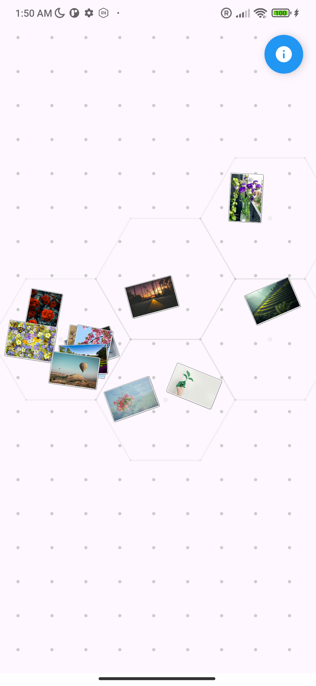
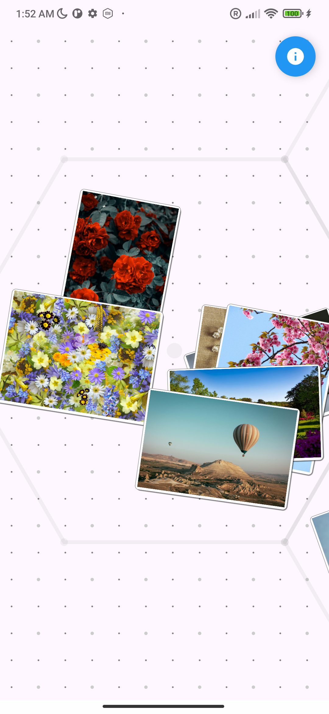
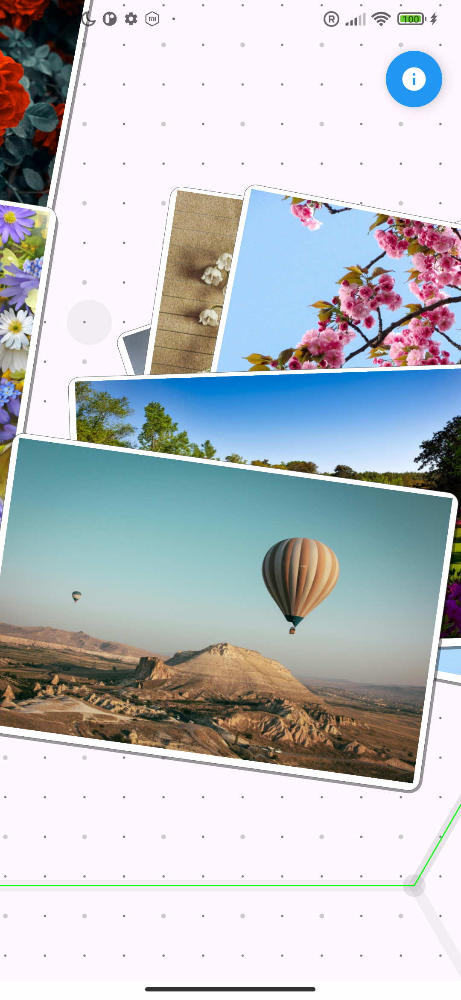

# Lumina

[](https://github.com/desugar-64/lumina-gallery)
[](https://opensource.org/licenses/MIT)

> [!WARNING]
> This project is currently in its very early stages and is undergoing heavy development.
>
> **It serves primarily as a playground for experimenting with various "AI" agentic assistants**. As such, the code quality is not guaranteed and is subject to frequent changes and refactoring.
> 
> Therefore, I wouldn't put too much hope into this project. 😄

## 🎥 Demo

|            Hexagonal Grid Visualization             |                        Permissions System                        |
|:---------------------------------------------------:|:----------------------------------------------------------------:|
|       |                  |
| *Dynamic, zoomable hexagonal grid layout for media* | *Modern Android 14+ permission flow with Limited Access support* |
|                                |                                             |

<div align="center">
  
  
  
</div>

---

Lumina is a modern, offline-first Android gallery application designed with a unique and visually rich user experience in mind. It moves beyond traditional grid layouts, leveraging advanced graphics capabilities, custom animations, and a fluid, gesture-based interface. Lumina is built to be a powerful, private, and beautiful home for your local media.

## ✨ Key Features

-   **🖼️ Real Photo Rendering**: Advanced atlas texture system displaying actual photo thumbnails instead of placeholders, with hardware-accelerated scaling and GPU optimization.
-   **📐 Hexagonal Grid Visualization**: Unique hexagonal grid layout for displaying grouped media on a zoomable, pannable canvas with ring-based generation. Photos are randomly positioned within cells with realistic rotation angles, simulating the natural behavior of physical photos being scattered onto a table surface.
-   **⚡ Atlas Texture System**: Sophisticated Level-of-Detail (LOD) rendering with 2048x2048 texture atlases, shelf packing algorithm, smart fallback mechanisms, and comprehensive performance instrumentation.
-   **🎯 Smart Permissions**: Modern Android 10-15 permission system with transparent support for Android 14+ "Limited Access" mode.
-   **🔒 Privacy-First**: Respects user choice - works with full library access or selected photos. Your privacy is paramount.
-   **🚀 Advanced Graphics & UI**: Dynamic, zoomable, and pannable canvas powered by custom rendering, matrix-based transformations, and reactive state management.
-   **🏗️ Clean Architecture**: Separation of concerns with domain/data/UI layers, dependency injection via Hilt, and comprehensive error handling.
-   **📁 Direct Media Access**: Interfaces directly with the Android `MediaStore` API to efficiently access all photos and videos on your device.
-   **📊 Atlas Benchmarking System**: Comprehensive atlas performance benchmarking with timeline tracking, baseline management, optimization progression monitoring, and automated Gradle workflow targeting 300ms generation times.

## 🛠️ Project Info & Tech Stack

Lumina is built using a modern Android technology stack, emphasizing clean architecture, maintainability, and performance.

-   **UI**: [Jetpack Compose](https://developer.android.com/jetpack/compose) with Material 3 design system for a fully declarative and dynamic UI.
-   **Language**: 100% [Kotlin](https://kotlinlang.org/) with Coroutines and StateFlow for reactive programming.
-   **Architecture**: Clean Architecture with separate domain, data, and UI layers using [Hilt](https://dagger.dev/hilt/) for dependency injection.
-   **Graphics**: Advanced atlas texture system with hardware-accelerated photo scaling, shelf packing algorithm, and Level-of-Detail (LOD) rendering.
-   **Permissions**: Modern Android 10-15 permission system with automatic version detection and Android 14+ Limited Access support.
-   **Gestures**: Advanced matrix-based transformations for smooth pan, zoom, and scale operations with performance optimizations.
-   **State Management**: Reactive StateFlow architecture with proper Compose side-effects patterns (LaunchedEffect, snapshotFlow, rememberUpdatedState).
-   **Build System**: [Gradle](https://gradle.org/) with the [Kotlin DSL](https://docs.gradle.org/current/userguide/kotlin_dsl.html) (`build.gradle.kts`), providing a type-safe and expressive build configuration.
-   **Dependency Management**: Centralized dependency management using a TOML Version Catalog (`libs.versions.toml`), ensuring consistency and ease of updates.
-   **Media**: Direct integration with Android's `MediaStore` API for robust and efficient media handling.
-   **Performance**: Comprehensive benchmarking infrastructure with 25+ detailed metrics, I/O separation tracking, HTML report generation, and 300ms optimization targets.

## 🏗️ How to Build

To build and run the project, you will need Android Studio (latest stable version recommended) and JDK 17 or higher.

1.  **Clone the repository:**
    ```bash
    git clone git@github.com:desugar-64/lumina-gallery.git
    ```

2.  **Navigate to the project directory:**
    ```bash
    cd lumina-gallery
    ```

3.  **Build the application using the Gradle wrapper:**
    To generate a debug APK, run:
    ```bash
    ./gradlew assembleDebug
    ```

4.  **Install on a connected device or emulator:**
    ```bash
    ./gradlew installDebug
    ```

The APK will be located in `app/build/outputs/apk/debug/`.

## 📊 Atlas Performance Benchmarking

Lumina includes a comprehensive benchmarking system for tracking atlas texture performance improvements over time. The system targets aggressive 300ms generation times (down from ~1600ms baseline).

### Quick Start

```bash
# 1. Initialize fresh baseline
./gradlew :benchmark:initAtlasBaseline

# 2. Track optimization improvements
./gradlew :benchmark:benchmarkAtlasOptimization -Poptimization.name="bitmap_pool"
./gradlew :benchmark:benchmarkAtlasOptimization -Poptimization.name="hardware_canvas"

# 3. View timeline and generate reports
./gradlew :benchmark:listAtlasTimeline
./gradlew :benchmark:generateAtlasReport
```

### Available Benchmarking Tasks

| Task | Description | Usage |
|------|-------------|-------|
| `initAtlasBaseline` | Initialize fresh timeline with new baseline | `./gradlew :benchmark:initAtlasBaseline` |
| `updateAtlasBaseline` | Update baseline while preserving optimization history | `./gradlew :benchmark:updateAtlasBaseline` |
| `benchmarkAtlasOptimization` | Track specific optimization improvement | `./gradlew :benchmark:benchmarkAtlasOptimization -Poptimization.name="your_name"` |
| `listAtlasTimeline` | Display all benchmark entries with performance summary | `./gradlew :benchmark:listAtlasTimeline` |
| `cleanAtlasTimeline` | Remove all timeline data and start fresh | `./gradlew :benchmark:cleanAtlasTimeline` |
| `cleanAtlasExperimental` | Remove experimental (-dirty) entries only | `./gradlew :benchmark:cleanAtlasExperimental` |
| `generateAtlasReport` | Generate HTML performance report | `./gradlew :benchmark:generateAtlasReport` |

### Benchmarking Workflow

#### 1. **Establish Baseline**
```bash
# Start with clean baseline measurement
./gradlew :benchmark:initAtlasBaseline -Pbaseline.name="baseline_v1"
```
**Expected Output:**
```
🎯 Initializing fresh atlas baseline: baseline_v1
📊 Found latest benchmark result: AtlasPerformanceBenchmark_xyz.json
✅ Collected benchmark result for: baseline_v1
📱 Device: Google Pixel 7
🔄 Git commit: a1b2c3d

📊 Atlas Performance (Zoom Test):
   Total Generation Time: 1623.4ms
   Bitmap Loading (I/O): 234.5ms
   Bitmap Scaling: 892.1ms
   Canvas Rendering: 456.8ms
   GPU Memory: 87.3MB
   Heap Memory: 234.1MB

🔄 Timeline entries: 1
```

#### 2. **Track Optimizations**
```bash
# After implementing bitmap pool optimization
./gradlew :benchmark:benchmarkAtlasOptimization -Poptimization.name="bitmap_pool"

# After implementing hardware canvas optimization
./gradlew :benchmark:benchmarkAtlasOptimization -Poptimization.name="hardware_canvas"
```

#### 3. **Monitor Progress**
```bash
# View comprehensive timeline
./gradlew :benchmark:listAtlasTimeline
```
**Expected Output:**
```
📊 Timeline entries (3 total):
================================================================================
 0. 2025-07-01T10:30:25 | baseline_v1          | a1b2c3d      | 1623.4ms | Pixel 7
 1. 2025-07-01T11:15:42 | bitmap_pool          | b2c3d4e      | 1342.7ms | Pixel 7  
 2. 2025-07-01T12:45:18 | hardware_canvas      | c3d4e5f      |  876.2ms | Pixel 7
================================================================================

📈 Improvement since baseline (baseline_v1):
   Atlas Generation: 1623.4ms → 876.2ms
   Improvement: +46.0%
   Bitmap Scaling: +23.4%
   Canvas Rendering: +67.8%
```

### Performance Metrics Tracked

The system monitors **25+ detailed metrics** across the entire atlas pipeline:

#### **Primary Optimization Targets (300ms goal)**
- `AtlasManager.generateAtlasSumMs` - Total atlas generation time
- `PhotoLODProcessor.scaleBitmapSumMs` - Bitmap scaling operations  
- `AtlasGenerator.softwareCanvasSumMs` - Software canvas rendering

#### **I/O Separation Tracking**
- **Disk I/O**: ContentResolver file access, file header reading
- **Memory I/O**: Bitmap bounds/full decoding, sample size calculation

#### **Hardware Operations**
- PhotoScaler hardware-accelerated scaling
- Bitmap creation/cropping operations
- Memory allocation/recycling patterns

#### **Algorithm Performance**
- Texture packing shelf algorithm
- Image sorting and shelf fitting
- Atlas coordination and LOD selection

### Advanced Usage

#### **Experimental Development**
```bash
# Allow uncommitted changes for rapid iteration
./gradlew :benchmark:benchmarkAtlasOptimization -Poptimization.name="experimental_fix" -Pallow.dirty

# Clean experimental entries when done
./gradlew :benchmark:cleanAtlasExperimental
```

#### **Baseline Management**
```bash
# Update baseline after major improvements (preserves optimization history)
./gradlew :benchmark:updateAtlasBaseline -Pbaseline.name="baseline_v2"

# Complete restart
./gradlew :benchmark:cleanAtlasTimeline -Pforce
./gradlew :benchmark:initAtlasBaseline
```

#### **Direct Python Script Usage**
```bash
# Alternative to Gradle tasks
python scripts/atlas_benchmark_collector.py init benchmark.json --baseline-name="custom_baseline"
python scripts/atlas_benchmark_collector.py collect benchmark.json "optimization" --mode=optimization
python scripts/atlas_timeline_chart.py  # Generate HTML report
```

### Reports and Visualization

The system generates comprehensive HTML reports showing:
- **Performance timeline** with improvement tracking
- **Component breakdown** charts (I/O, scaling, rendering)
- **Target progress** visualization (300ms goal)
- **Memory usage** trends over time
- **Device context** and git commit tracking

Reports are saved to `benchmark_results/atlas_performance_report.html` and automatically opened after generation.

### Performance Targets

| Metric | Current Baseline | Target | Status |
|--------|------------------|--------|--------|
| **Total Atlas Generation** | ~1600ms | 300ms | 🔴 5.3x improvement needed |
| **Bitmap Scaling** | ~900ms | <100ms | 🔴 Primary optimization target |
| **Software Canvas** | ~450ms | <50ms | 🔴 Hardware acceleration needed |
| **Memory Usage** | ~200MB | <150MB | 🟡 Optimization in progress |

**🎯 Goal**: Achieve 80% performance improvement (1600ms → 300ms) through systematic optimization of bitmap operations and canvas rendering.

## 🤝 Contributing

Contributions are welcome! If you have ideas for new features, improvements, or bug fixes, please open an issue to discuss it first. Pull requests are also appreciated.

## 📄 License

This project is licensed under the MIT License. See the [LICENSE](LICENSE) file for details.
