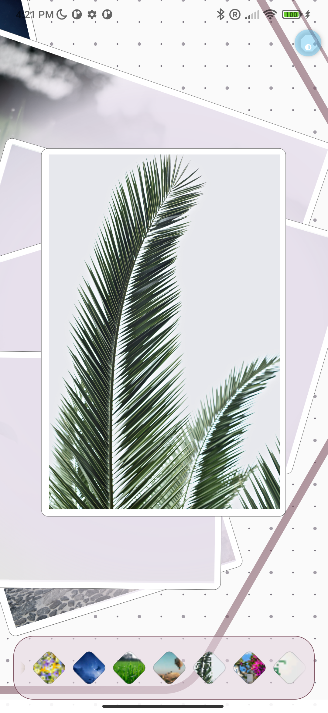
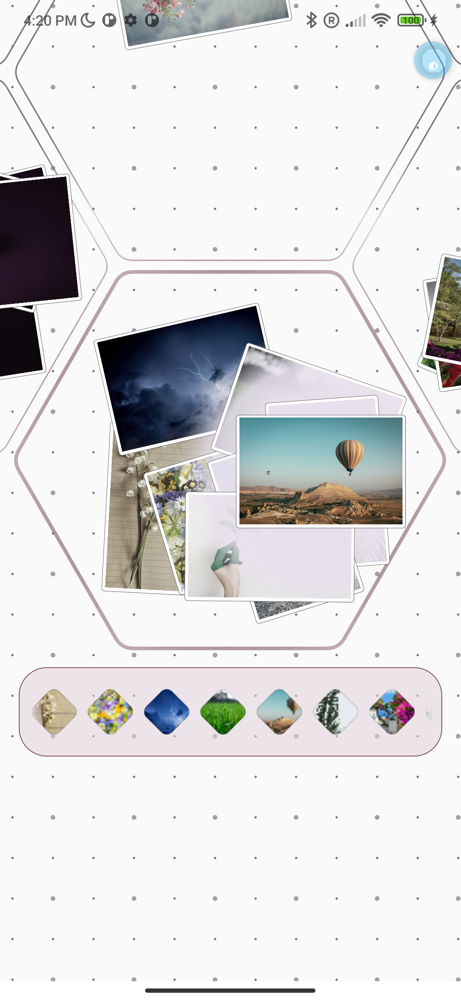

# Lumina

[](https://github.com/desugar-64/lumina-gallery)
[](https://opensource.org/licenses/MIT)

> [!WARNING]
> This project is currently in its very early stages and is undergoing heavy development.
>
> **It serves primarily as a playground for experimenting with various "AI" agentic assistants**. As such, the code quality is not guaranteed and is subject to frequent changes and refactoring.
> 
> Therefore, I wouldn't put too much hope into this project. 😄

## 🎥 Demo

|            Hexagonal Grid Visualization             |                           Permissions System                           |
|:---------------------------------------------------:|:----------------------------------------------------------------------:|
|       |  |
| *Dynamic, zoomable hexagonal grid layout for media* |          *LOD system for managing large numbers of previews*           |
|            |                        |
|               *Smooth image viewing*                |    *Modern Android 14+ permission flow with Limited Access support*    |

<div align="center">
  
  
  
  
  
</div>

---

Lumina is a modern, offline-first Android gallery application designed with a unique and visually rich user experience in mind. It moves beyond traditional grid layouts, leveraging advanced graphics capabilities, custom animations, and a fluid, gesture-based interface. Lumina is built to be a powerful, private, and beautiful home for your local media.

## ✨ Key Features

-   **🖼️ Real Photo Rendering**: Advanced atlas texture system displaying actual photo thumbnails instead of placeholders, with hardware-accelerated scaling and GPU optimization.
-   **📐 Hexagonal Grid Visualization**: Unique hexagonal grid layout for displaying grouped media on a zoomable, pannable canvas with ring-based generation. Photos are randomly positioned within cells with realistic rotation angles, simulating the natural behavior of physical photos being scattered onto a table surface.
-   **⚡ Atlas Texture System**: Sophisticated Level-of-Detail (LOD) rendering with functional composition-based atlas generation, pure function extractors for strategy selection, Result-type error handling, and comprehensive performance instrumentation with 2K/4K/8K multi-atlas support.
-   **🎯 Smart Permissions**: Modern Android 10-15 permission system with transparent support for Android 14+ "Limited Access" mode.
-   **🔒 Privacy-First**: Respects user choice - works with full library access or selected photos. Your privacy is paramount.
-   **🚀 Advanced Graphics & UI**: Dynamic, zoomable, and pannable canvas powered by custom rendering, matrix-based transformations, and reactive state management.
-   **🏗️ Clean Architecture**: Separation of concerns with domain/data/UI layers, dependency injection via Hilt, and comprehensive error handling.
-   **🧮 Functional Programming Architecture**: Pure function composition with extracted strategy selectors, decision composers, and Result-type error handling for improved testability and maintainability.
-   **📁 Direct Media Access**: Interfaces directly with the Android `MediaStore` API to efficiently access all photos and videos on your device.
-   **📊 Atlas Benchmarking System**: Comprehensive atlas performance benchmarking with timeline tracking, baseline management, optimization progression monitoring, and automated Gradle workflow targeting 300ms generation times.

## 🛠️ Project Info & Tech Stack

Lumina is built using a modern Android technology stack, emphasizing clean architecture, maintainability, and performance.

-   **UI**: [Jetpack Compose](https://developer.android.com/jetpack/compose) with Material 3 design system for a fully declarative and dynamic UI.
-   **Language**: 100% [Kotlin](https://kotlinlang.org/) with Coroutines and StateFlow for reactive programming.
-   **Architecture**: Clean Architecture with functional programming patterns, pure function composition, Result-type error handling, separate domain/data/UI layers, and [Hilt](https://dagger.dev/hilt/) dependency injection.
-   **Graphics**: Advanced atlas texture system with hardware-accelerated photo scaling, functional composition-based shelf packing algorithm, and Level-of-Detail (LOD) rendering with 2K/4K/8K multi-atlas support.
-   **Permissions**: Modern Android 10-15 permission system with automatic version detection and Android 14+ Limited Access support.
-   **Gestures**: Advanced matrix-based transformations for smooth pan, zoom, and scale operations with performance optimizations.
-   **State Management**: Reactive StateFlow architecture with proper Compose side-effects patterns (LaunchedEffect, snapshotFlow, rememberUpdatedState).
-   **Build System**: [Gradle](https://gradle.org/) with the [Kotlin DSL](https://docs.gradle.org/current/userguide/kotlin_dsl.html) (`build.gradle.kts`), providing a type-safe and expressive build configuration.
-   **Dependency Management**: Centralized dependency management using a TOML Version Catalog (`libs.versions.toml`), ensuring consistency and ease of updates.
-   **Media**: Direct integration with Android's `MediaStore` API for robust and efficient media handling.
-   **Performance**: Comprehensive benchmarking infrastructure with 35+ detailed metrics, I/O separation tracking, functional composition performance analysis, HTML report generation, and 300ms optimization targets.

## 🏗️ How to Build

To build and run the project, you will need Android Studio (latest stable version recommended) and JDK 17 or higher.

1.  **Clone the repository:**
    ```bash
    git clone git@github.com:desugar-64/lumina-gallery.git
    ```

2.  **Navigate to the project directory:**
    ```bash
    cd lumina-gallery
    ```

3.  **Build the application using the Gradle wrapper:**
    To generate a debug APK, run:
    ```bash
    ./gradlew assembleDebug
    ```

4.  **Install on a connected device or emulator:**
    ```bash
    ./gradlew installDebug
    ```

The APK will be located in `app/build/outputs/apk/debug/`.


## 🤝 Contributing

Contributions are welcome! If you have ideas for new features, improvements, or bug fixes, please open an issue to discuss it first. Pull requests are also appreciated.

## 📄 License

This project is licensed under the MIT License. See the [LICENSE](LICENSE) file for details.
